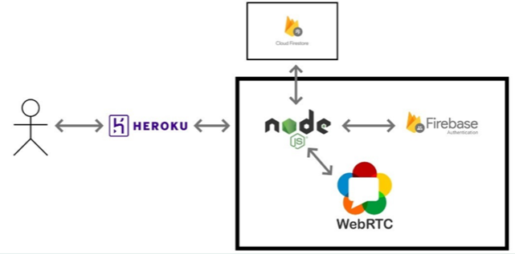

      
# On-감독  


---------------------------------------  
### 1. 프로젝트 소개
코로나바이러스 감염증(COVID-19)으로 인하여 비대면 활동이 활성화된 현재, 대학에서 진행되는 다양한 평가시험 또한 비대면으로 진행되는 상황이다. 하지만 비대면 시험의 특성상 개인 혹은 집단의 부정행위를 파악하기란 쉽지 않고 이에 따른 불만 혹은 불공정성이 제기되고 있다. 따라서 모두가 평등하게 시험을 응시할 수 있도록 비대면 시험에서 일어날 수 있는 부정행위를 적발하고 그에 맞는 제재를 가할 수 있도록 운영해야 한다. 이에 ON감독 서비스는 Web Real-Time Communication인 WebRTC를 이용하여 웹사이트에서 비대면 시험을 치를 수 있는 환경을 제공하고 부정행위를 검출하는 알고리즘을 개발하여 문제점을 해결한다.

---------------------------------------
### 2. Abstract
As non-face-to-face activities have been activated due to the coronavirus infection (COVID-19), various evaluation tests conducted at universities are also being conducted non-face-to-face. However, due to the nature of non-face-to-face examinations, it is not easy to identify individual or group misconduct, and complaints or unfairness are raised. Therefore, in order to ensure that everyone can take the test equally, it is necessary to operate so that fraudulent acts that may occur in non-face-to-face tests can be detected and appropriate sanctions are applied. Accordingly, ON supervision service uses WebRTC, a Web Real-Time Communication, to provide an environment for taking non-face-to-face tests on a website and solves problems by developing an algorithm to detect cheating.

---------------------------------------
### 3. 시연 영상
<a href="https://youtu.be/R8JPlvt5Rjg">
      
  </a>

---------------------------------------
### 4. 팀 소개
```markdown
**장우석**   
1.Student ID: 20171692    
2.e-mail: reverse@kookmin.ac.kr   
3.Role: algorithm   
```   
```markdown   
**최근표**   
1.Student ID: 20171710   
2.e-mail: ckp220@kookmin.ac.kr   
3.Role: front-end & ui   
```
```markdown
**한창희**   
1.Student ID: 20171719   
2.e-mail: sjrnfl0412@kookmin.ac.kr   
3.Role: leader, back-end & server
```
---------------------------------------
### 5. 사용법

-local 환경에서 테스트

```markdown
local에서 테스트를 진행할 경우 세션이 브라우저를 종료시킬 때까지 유지되므로 학생과 교수의 브라우저를 다르게 실행한다.
$ git clone https://github.com/kookmin-sw/capstone-2022-19.git
$ cd capstone-2022-19
$ npm install
$ npm start
```
-heroku 환경에서 테스트
```markdown
$ heroku login
$ heroku create <YOUR-APP-NAME>
$ git clone https://github.com/kookmin-sw/capstone-2022-19.git
$ cd capstone-2022-19
$ heroku git:remote -a <YOUR-APP-NAME>
$ git push heroku master
```
-수정 및 재배포
```markdown
$ git add .
$ git commit -m "commit message" 
$ git push heroku master
```

---------------------------------------
### 6. 시스템 구조



